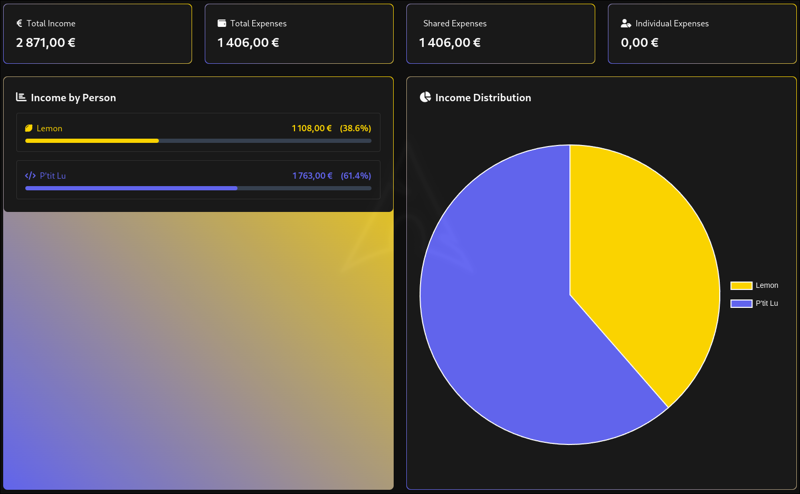
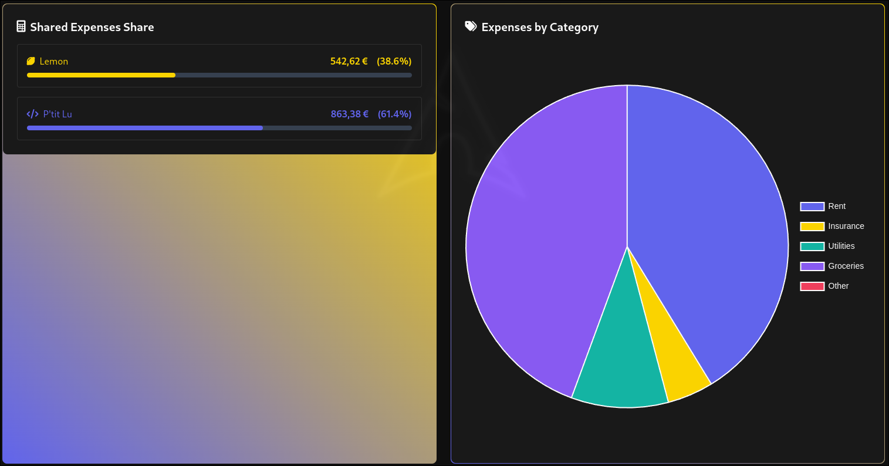
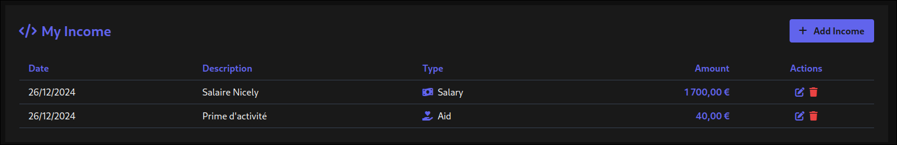
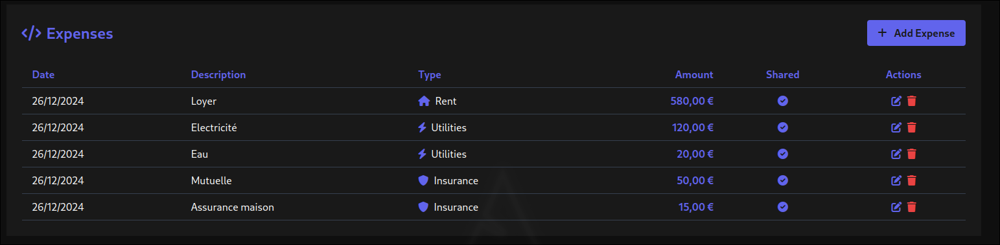
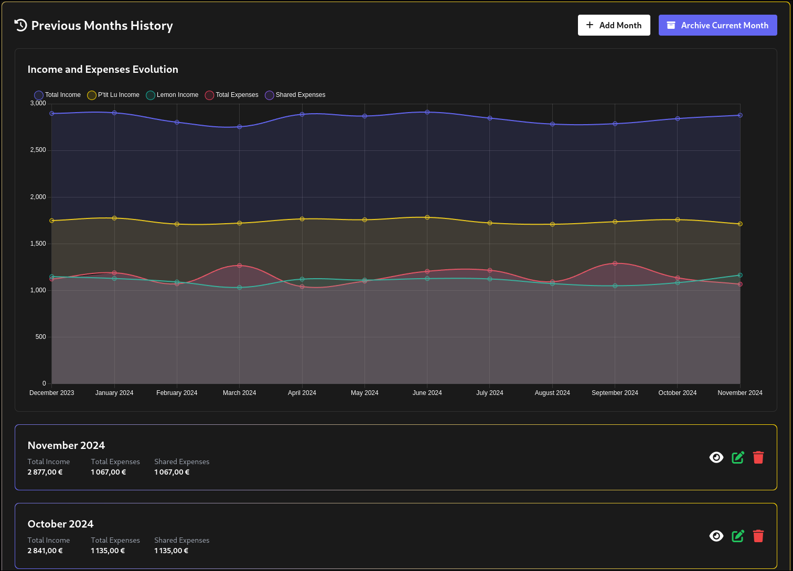

# Budget 💰





Budget management application designed to track couple's income and expenses.

## ✨ Key Features

- 📊 Interactive dashboard with real-time charts
- 💰 Individual income management
- 💸 Shared and personal expense tracking
- 📅 Monthly automatic archiving and history

## 🚀 Installation

1. **Requirements**
   - PHP 8.1+
   - Composer
   - Node.js & NPM

2. **Setup**
```bash
# Clone the project
git clone https://github.com/your-username/budget.git
cd budget-mobile

# Install dependencies
composer install
npm install

# Configure environment
cp .env.example .env
php artisan key:generate

# Run migrations
php artisan migrate --seed

# Build assets
npm run dev

# Start server
php artisan serve
```

## 🔧 Maintenance

Automatic archiving command:
```bash
php artisan archive:last-month
```

## 🛡️ Security

- ✅ Required authentication
- ✅ CSRF protection
- ✅ Data validation
- ✅ Secure transactions
- ✅ Archive locking

## 🎨 Customization

- `public/css/history/styles.css`: global styles
- `tailwind.config.js`: Tailwind themes
- `.env`: configurations

## 📝 License

[WTFPL License.](http://www.wtfpl.net/)
